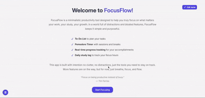

# FocusFlow - Minimalist Productivity Tool


FocusFlow is a clean, distraction-free productivity tool designed to help you focus on what truly matters - your work, study, and personal growth. Built with intentional simplicity, it provides just the essential features you need without the clutter of bloated apps. Part of my [#100DaysOfCode](https://github.com/dipanshu447/100-days-of-reactjs) challenge journey.



## Features

### Smart Task Management
- Interactive to-do list with completion tracking
- Visual progress indicators (percentage and progress bar)
- "All caught up!" motivational messages

### Focus Sessions
- Customizable Pomodoro timer (25/5 default)
- Session counter with break tracking
- Browser notifications for session transitions

### Productivity Insights
- Daily focus time tracking (auto-resets at midnight)
- Clean visual dashboard
- Persistent data (local storage)

### My Learning Journey
This project represents my first fully-developed React application, created during my [#100DaysOfCode](https://github.com/dipanshu447/100-days-of-reactjs) challenge. Here's what I gained:

- Mastered React hooks (useState, useEffect, useRef)
- Advanced React state management techniques
- Browser Notification API implementation
- Clean UI/UX design principles
- Developed custom progress tracker
- Responsive layout strategies
- Practiced clean component architecture

## Technologies Used

- React.js with Vite for fast development
- Vanilla CSS for clean, lightweight styling
- Browser APIs (Notifications, Local Storage)
- JavaScript (ES6+)

## Getting Started

1. Clone the repository:
   ```bash
   git clone https://github.com/dipanshu447/FocusFlow.git
   ```
2. Install dependencies:
    ```bash
    npm install
    ```
3. Run the development server:
    ```bash
    npm run dev
    ```
## Inspiration & Credits

FocusFlow is inspired by the Pomodoro technique and minimal task management tools like [Pomofocus.io](https://pomofocus.io/). Icons by [Icons8](https://icons8.com/icons), styling ideas from [Dribbble](https://dribbble.com/) shots.

### Feedback & Contributions
I’m always open to feedback, suggestions, or improvements. Feel free to open an issue or fork this repository to contribute. Every bit of feedback helps me learn and grow.